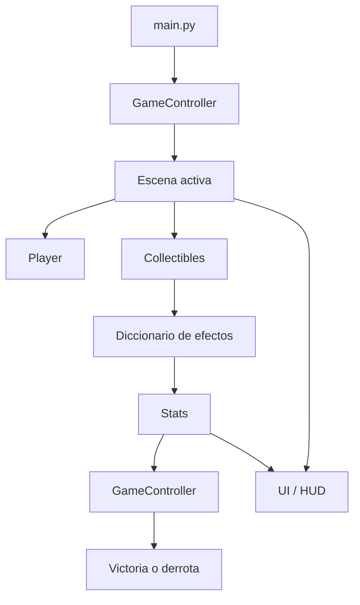
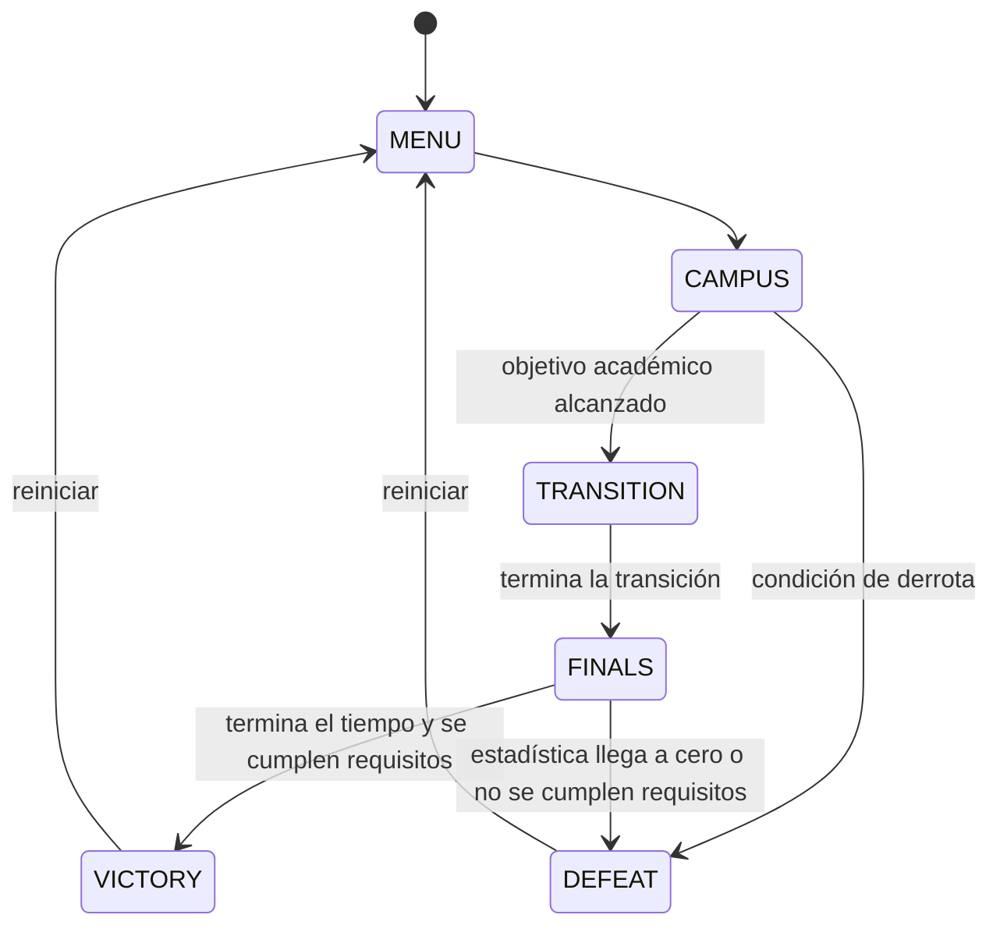

# Arquitectura del proyecto

## 1. Propósito del documento

Este documento describe la arquitectura técnica de **Supervivencia Universitaria: La Vida Da Vueltas**, un videojuego arcade para un jugador desarrollado con Python y PyGame.

Su finalidad es:

* establecer las responsabilidades de cada módulo;
* documentar el flujo principal de ejecución;
* definir los contratos entre los componentes;
* evitar dependencias circulares y duplicación de lógica;
* facilitar la integración del trabajo desarrollado en ramas separadas;
* servir como referencia para pruebas, mantenimiento y exposición del proyecto.

La arquitectura adoptada es un **monolito modular basado en una máquina de estados**. El juego se ejecuta como una sola aplicación, pero sus responsabilidades se encuentran separadas en módulos con interfaces definidas.

---

## 2. Principios arquitectónicos

El proyecto sigue los siguientes principios:

1. `main.py` inicializa PyGame y ejecuta el game loop, pero no implementa las reglas internas de las escenas.
2. `game_logic.py` es responsable de coordinar el estado global del juego.
3. Cada escena administra únicamente los elementos y reglas que le pertenecen.
4. `Player` encapsula movimiento, posición y límites, pero no conoce estadísticas, escenas ni condiciones de victoria.
5. Los objetos recolectables describen sus efectos mediante datos; no modifican directamente las estadísticas.
6. La interfaz presenta información, pero no decide las reglas del juego.
7. Los módulos no deben importar `main.py`.
8. Deben evitarse variables globales mutables e importaciones circulares.
9. La lógica de movimiento debe ser independiente de la cantidad de FPS.
10. Los módulos deben poder probarse de manera aislada.

---

## 3. Estructura del proyecto

```text
supervivencia-universitaria/
├── main.py
├── game_logic.py
├── player.py
├── collectibles.py
├── scenes.py
├── stats.py
├── events.py
├── ui.py
├── constants.py
├── requirements.txt
├── requirements-dev.txt
├── assets/
├── sounds/
├── docs/
│   └── ARCHITECTURE.md
└── tests/
```

### Responsabilidades generales

| Archivo           | Responsabilidad                                                                 |
| ----------------- | ------------------------------------------------------------------------------- |
| `main.py`         | Inicialización de PyGame, game loop y delegación al controlador                 |
| `game_logic.py`   | Máquina de estados y coordinación de las escenas                                |
| `player.py`       | Movimiento, posición, colisiones espaciales y límites del jugador               |
| `collectibles.py` | Entidad recolectable, efectos declarativos, caducidad y detección de colisiones |
| `scenes.py`       | Escenarios Campus, Transición y Semana de Finales                               |
| `stats.py`        | Energía, dinero, notas y aplicación de efectos                                  |
| `events.py`       | Eventos aleatorios denominados Giros de la vida                                 |
| `ui.py`           | Menú, HUD, mensajes y pantallas de resultado                                    |
| `constants.py`    | Resolución, FPS, tiempos, colores y parámetros de balance                       |
| `tests/`          | Pruebas unitarias y de integración del núcleo del juego                         |

---

## 4. Flujo general de ejecución



El flujo principal por frame es:

```text
1. Obtener delta time.
2. Leer eventos de PyGame.
3. Procesar eventos globales.
4. Delegar eventos a GameController.
5. Actualizar la escena activa.
6. Evaluar cambios de estado.
7. Dibujar la escena activa.
8. Actualizar la pantalla.
```

Representación simplificada:

```python
while running:
    dt = clock.tick(FPS) / 1000.0

    for event in pygame.event.get():
        controller.handle_event(event)

    controller.update(dt)
    controller.draw(screen)

    pygame.display.flip()
```

`main.py` no debe conocer la lógica interna de los recolectables, los criterios de Campus ni las reglas de las estadísticas.

---

## 5. Máquina de estados

El juego utiliza un único estado global representado mediante `GameState`.

```text
MENU
CAMPUS
TRANSITION
FINALS
VICTORY
DEFEAT
```

Flujo previsto:



Durante la etapa actual de desarrollo, el juego puede iniciar directamente en `CAMPUS` hasta que el menú definitivo sea integrado.

No deben utilizarse varios booleanos simultáneos como:

```python
in_menu = False
in_campus = True
in_finals = False
```

La representación correcta es:

```python
current_state = GameState.CAMPUS
```

Esto garantiza que solo exista un estado activo.

---

## 6. GameController

`GameController`, definido en `game_logic.py`, es el coordinador principal.

Sus responsabilidades son:

* almacenar `current_state`;
* mantener las instancias de las escenas;
* delegar eventos;
* actualizar la escena activa;
* dibujar la escena activa;
* ejecutar cambios de estado;
* reiniciar la sesión;
* consultar las condiciones de victoria y derrota cuando las estadísticas estén integradas.

Interfaz principal:

```python
controller.handle_event(event)
controller.update(dt)
controller.draw(screen)
controller.restart()
```

La propiedad `active_scene` devuelve la escena correspondiente al estado actual.

El controlador no debe implementar:

* movimiento del jugador;
* aparición de recolectables;
* dibujo del HUD;
* modificación directa de estadísticas;
* contenido interno de los eventos aleatorios.

---

## 7. Contrato común de las escenas

Cada escena debe proporcionar los siguientes métodos:

```python
handle_event(event)
update(dt)
draw(screen)
is_complete()
reset()
```

### `handle_event(event)`

Procesa eventos discretos propios de la escena.

Ejemplos:

* pulsación de una tecla especial;
* selección de una opción;
* confirmación de una transición.

El movimiento continuo del jugador no depende de `KEYDOWN`, sino del estado actual del teclado consultado en `Player.update()`.

### `update(dt)`

Actualiza la lógica de la escena:

* jugador;
* temporizador;
* objetos;
* colisiones;
* generación de elementos;
* finalización de la escena.

`dt` se expresa en segundos.

### `draw(screen)`

Dibuja únicamente la representación visual de la escena.

No debe decidir reglas de victoria o modificar estadísticas.

### `is_complete()`

Informa si la escena terminó.

Este método no implica necesariamente victoria. Por ejemplo:

* Campus puede terminar porque se alcanzó el objetivo;
* Campus también puede terminar porque se agotó el tiempo;
* Finales termina cuando su temporizador llega a cero.

El controlador interpreta la causa y decide el siguiente estado.

### `reset()`

Restaura completamente el estado interno de la escena para permitir una nueva partida.

---

## 8. Escenario Campus

`CampusScene` representa la primera etapa del juego.

### Objetivo

Recolectar 15 materiales académicos antes de que termine el tiempo.

Duración configurada:

```text
120 segundos
```

### Elementos académicos

* tareas;
* apuntes;
* trabajos.

Estos objetos tienen:

```python
objective_points = 1
```

### Distracciones

* redes sociales;
* videojuegos;
* falta de sueño.

Estos objetos tienen:

```python
objective_points = 0
```

Por tanto, una distracción puede aplicar efectos negativos, pero no aumenta el progreso del Campus.

### Finalización

```python
scene.objective_reached
scene.time_expired
```

La escena se considera completa si ocurre cualquiera de estas condiciones. La decisión sobre el siguiente estado pertenece a `GameController`.

---

## 9. Escenario de transición

`TransitionScene` separa visual y lógicamente Campus de Semana de Finales.

Duración configurada:

```text
3 segundos
```

Actualmente utiliza una animación circular relacionada con el concepto narrativo de que la vida da vueltas.

La transición:

* no contiene jugador;
* no genera objetos;
* no modifica estadísticas;
* finaliza exclusivamente por tiempo.

Cuando termina, `GameController` cambia el estado a `FINALS`.

---

## 10. Escenario Semana de Finales

`FinalsScene` representa la segunda etapa jugable.

### Objetivo

El objetivo no consiste en recoger una cantidad específica de objetos.

La meta es:

```text
resistir hasta que el temporizador llegue a cero
```

Duración configurada:

```text
150 segundos
```

El número de objetos recogidos es una métrica informativa, no una condición de victoria.

### Elementos positivos

* apuntes;
* café;
* puntos extra.

### Elementos negativos

* enfermedad;
* falta de sueño;
* examen sorpresa.

La distribución ponderada está orientada a producir aproximadamente:

```text
40 % de objetos positivos
60 % de objetos negativos
```

### Finalización

`FinalsScene` se completa cuando:

```python
remaining_time <= 0
```

Una vez integradas las estadísticas, `GameController` deberá decidir:

```text
VICTORY:
- terminó el tiempo;
- energía > 0;
- dinero > 0;
- notas suficientes.

DEFEAT:
- energía, dinero o notas llegan a 0;
- o no se cumplen las condiciones mínimas al terminar.
```

`FinalsScene` no debe decidir directamente el resultado.

---

## 11. Player

`Player` hereda de:

```python
pygame.sprite.Sprite
```

Atributos principales:

```python
player.image
player.rect
player.position
player.direction
player.speed
```

### Movimiento

El desplazamiento utiliza:

```python
position += direction * speed * dt
```

Esto hace que el movimiento sea independiente de los FPS.

### Movimiento diagonal

El vector de dirección se normaliza:

```python
if direction.length_squared() > 0:
    direction.normalize_ip()
```

Sin normalización, el movimiento diagonal sería aproximadamente `sqrt(2)` veces más rápido.

### Precisión subpíxel

`pygame.Rect` utiliza coordenadas enteras. Por ello:

* `Vector2 position` conserva decimales;
* `rect` se utiliza para dibujo y colisiones;
* ambas representaciones se sincronizan cuando es necesario.

### Límites

El jugador permanece dentro del área jugable mediante:

```python
rect.clamp_ip(bounds)
```

`Player` no importa ni conoce:

* estadísticas;
* escenas;
* controlador;
* eventos aleatorios;
* HUD.

---

## 12. Recolectables

Los recolectables están representados por `Collectible`, que también hereda de:

```python
pygame.sprite.Sprite
```

Cada objeto contiene:

```python
item.item_type
item.effects
item.objective_points
item.remaining_lifetime
item.image
item.rect
```

Ejemplo:

```python
Collectible(
    position=(300, 200),
    item_type="coffee",
    effects={
        "energy": 10,
        "money": -5,
    },
    objective_points=0,
)
```

### Efectos declarativos

Los efectos se almacenan como datos:

```python
{
    "energy": 10,
    "money": -5,
    "grades": 0,
}
```

El recolectable no modifica directamente las estadísticas.

La escena comunica el efecto:

```python
effect_handler(item.effects)
```

La implementación definitiva podrá utilizar:

```python
effect_handler=stats.apply_effect
```

### Colisiones

La detección se realiza mediante:

```python
pygame.sprite.spritecollide(
    player,
    items,
    dokill=True,
)
```

Cuando existe una colisión:

1. el objeto se elimina del grupo;
2. se devuelve el objeto recolectado;
3. la escena comunica su efecto;
4. la escena actualiza el progreso que le corresponda.

### Caducidad

Los recolectables pueden tener un tiempo de vida limitado. Cuando llega a cero, el objeto se elimina mediante:

```python
self.kill()
```

---

## 13. Contrato con estadísticas

El contrato acordado para aplicar modificaciones es:

```python
stats.apply_effect({
    "energy": -10,
    "money": 0,
    "grades": 8,
})
```

Las claves admitidas son:

```text
energy
money
grades
```

Los recolectables normalizan el diccionario para que las tres claves estén siempre presentes.

Las estadísticas deberán mantenerse dentro del rango:

```text
0 a 100
```

El progreso de Campus no pertenece a `stats.py`.

Por tanto, esto sería incorrecto:

```python
stats.apply_effect({
    "tasks": 1,
})
```

El progreso académico se conserva dentro de `CampusScene` mediante:

```python
tasks_collected
target_tasks
```

---

## 14. Interfaz de usuario

`ui.py` será responsable de presentar:

* menú;
* HUD;
* energía;
* dinero;
* notas;
* temporizadores;
* mensajes;
* transición informativa;
* victoria;
* derrota.

La interfaz puede consultar el estado del juego, pero no debe modificar las reglas.

Ejemplo correcto:

```python
ui.draw_hud(screen, stats, remaining_time)
```

Ejemplo incorrecto:

```python
if ui.energy_bar_is_empty():
    controller.current_state = GameState.DEFEAT
```

La decisión de derrota debe provenir de la lógica y no del componente visual.

El texto mostrado actualmente en el título de la ventana es una herramienta diagnóstica temporal y podrá sustituirse por el HUD definitivo.

---

## 15. Eventos aleatorios

`events.py` implementará los llamados **Giros de la vida**.

Un evento deberá describirse mediante datos, por ejemplo:

```python
{
    "name": "Beca inesperada",
    "message": "Recibiste un apoyo económico.",
    "effects": {
        "energy": 0,
        "money": 15,
        "grades": 0,
    },
}
```

El sistema de eventos podrá:

1. seleccionar un evento;
2. comunicar sus efectos a estadísticas;
3. enviar su mensaje a la interfaz.

No debe dibujar directamente en pantalla ni modificar las escenas mediante variables globales.

---

## 16. Dependencias permitidas

Dependencias principales:

```text
main.py
└── game_logic.py

game_logic.py
└── scenes.py

scenes.py
├── player.py
├── collectibles.py
└── constants.py

player.py
└── constants.py

collectibles.py
└── constants.py
```

Dependencias previstas durante la integración:

```text
main.py
├── stats.py
└── ui.py

game_logic.py
└── stats.py o contrato de consulta equivalente

scenes.py
└── events.py mediante una interfaz desacoplada
```

Restricciones:

* ningún módulo importa `main.py`;
* `player.py` no importa escenas ni estadísticas;
* `collectibles.py` no importa estadísticas;
* `ui.py` no modifica reglas;
* deben evitarse ciclos como:

```text
game_logic.py → scenes.py → game_logic.py
```

---

## 17. Pruebas

El proyecto utiliza `pytest`.

La suite actual cubre:

* movimiento mediante delta time;
* normalización diagonal;
* teclas opuestas;
* límites del jugador;
* validación de efectos;
* colisiones;
* eliminación de objetos;
* caducidad;
* progreso de Campus;
* distracciones sin progreso;
* temporizadores;
* reinicio de escenas;
* transición de estados;
* configuración de producción;
* texto diagnóstico del objetivo de Finales.

Las pruebas utilizan los controladores SDL:

```text
SDL_VIDEODRIVER=dummy
SDL_AUDIODRIVER=dummy
```

Esto permite ejecutar PyGame sin abrir una ventana visible.

Comando de validación:

```bash
python -m pytest
```

Las pruebas no sustituyen la validación visual, pero permiten detectar regresiones en la lógica.

---

## 18. Estado de integración

### Núcleo implementado

* jugador;
* movimiento con delta time;
* límites;
* recolectables;
* colisiones;
* caducidad;
* Campus;
* transición;
* Semana de Finales;
* máquina de estados;
* reinicio;
* comunicación desacoplada de efectos;
* pruebas automatizadas.

### Pendiente de integración con otros módulos

* estadísticas reales;
* HUD;
* menú;
* eventos aleatorios;
* pantallas de victoria y derrota;
* sonidos;
* recursos gráficos definitivos;
* sustitución de figuras provisionales;
* evaluación final de victoria y derrota.

Las funcionalidades pendientes deben integrarse respetando los contratos descritos en este documento.

---

## 19. Decisiones pendientes

Antes de cerrar la versión final, el equipo debe acordar:

1. valor inicial de energía, dinero y notas;
2. nota mínima necesaria para ganar;
3. comportamiento exacto cuando se agota el tiempo de Campus;
4. frecuencia de los Giros de la vida;
5. duración de los mensajes en pantalla;
6. prioridad entre colisión y evento aleatorio en un mismo frame;
7. recursos gráficos y dimensiones definitivas;
8. efectos de sonido y volumen inicial;
9. comportamiento de los botones de reinicio y regreso al menú;
10. balance final de efectos positivos y negativos.

Estas decisiones deben centralizarse en `constants.py`, `stats.py`, `events.py` o `game_logic.py`, según corresponda, y no dispersarse en la interfaz.
